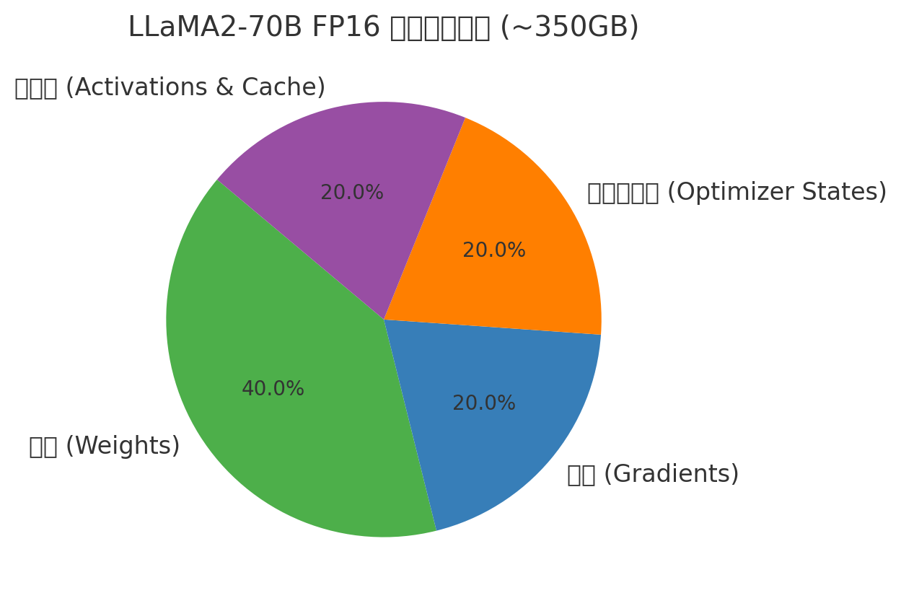

# 1 H100 
**H100** 指的是 **NVIDIA Hopper 架构 GPU**，全称 **NVIDIA H100 Tensor Core GPU**。  
这是英伟达在 2022 年发布的专门面向 **AI 大模型训练和推理** 的数据中心级 GPU。

主要特点
- **架构**：基于 **Hopper**（安培之后的下一代架构）。
- **显存**：常见版本是 **80GB HBM3 高带宽显存**，带宽可达 3TB/s 左右。
- **计算能力**：
    - 支持 **FP8 / FP16 / BF16 / FP32** 等多种精度。
    - 在 FP8/BF16 下，训练和推理大模型速度极快。
    - 比上一代 A100 在大模型场景下快 **3-4 倍**。
- **场景**：专门用来跑 GPT、LLaMA、Gemini、Claude 这类 **超大参数量 LLM**，以及高性能科学计算 (HPC)。
- **部署形态**：
    - 单卡（PCIe 插卡形式）
    - SXM5 模块（用于 DGX H100 服务器）
    - 常见配置：**8 卡 DGX H100**，或者云上租用（AWS p5、Azure NDv5、GCP A3）。

# 2 H100、H200、H800、H20之间的关系

H100 专门为大规模AI训练设计 , 拥有1w6个kuda 核心 和 80GB HBM3 显存 , 带宽 3.35TB/s
H200  140 GB HBM3 显存 , 带宽 4.8TB/s   .  使用 70GB 的llama2 模型 , 使用H200 比H100 快90% , 生成式ai 的优选 

H800 , 降低了 Nvlink互联带宽( 从 900GB/s 降到 400GB/s )  和 Fp64 双精度算力大幅度削减 (30T 到I T ), 适用于大规模集群训练的场景 

H20, FP16 算力仅为 148TFLops (为 H100 的 15% ), 保留 96GB 显存和4TB/s 的带宽 , 使其在部署大模型时 能通过多卡并联  弥补算力短板 

算力: H200 (训练和推理之间寻求更高的性价比 )> H100 (专注于大规模训练) >  H800 (在训练时 保持尽可能接近原生 H100 的 性能 ) > H20 (偏向于推理 )

# 3 

- **NVIDIA 路线：CUDA + TensorRT**
    
    - 完整的闭源生态
        
    - 针对 Transformer 类模型深度优化
        
    - 业界主流、性能最好
        
- **AMD 路线：ROCm + PyTorch + vLLM**
    
    - ROCm 替代 CUDA
        
    - 没有 TensorRT，只能依赖通用框架（PyTorch）
        
    - vLLM 作为开源推理优化层，填补缺少 TensorRT 的空白

# 4 GPU 计算平台
## 4.1 CUDA 核心

CUDA：NVIDIA 提供的 GPU 计算平台。PyTorch 用它来调用 GPU 做张量计算。
**CUDA**：NVIDIA 自家的底层 GPU 编程平台。所有深度学习框架都对 CUDA 优化最好。
- **全称**：Compute Unified Device Architecture
    
- **是谁的**：NVIDIA 推出的并行计算平台和编程模型
    
- **作用**：允许开发者使用 **GPU**（显卡）的强大并行计算能力来加速通用计算，而不仅仅是图形渲染。
    
- **场景**：
    
    - 训练深度学习模型（TensorFlow、PyTorch 都可以用 CUDA 加速）
        
    - 科学计算（数值模拟、大规模矩阵运算）
        
    - 高性能计算 (HPC)
        

👉 CUDA 就是 **让 GPU 能够像 CPU 一样被编程来跑数学运算** 的工具和生态。

我们常听到显卡有多少个 CUDA 核心 (CUDA Cores)，其实它就是 NVIDIA GPU 的最小并行计算单元。

📌 什么是 CUDA 核心
CUDA = Compute Unified Device Architecture，是 NVIDIA 的并行计算架构。
CUDA 核心 就是显卡里专门用来做计算的小单元，可以理解为 GPU 的“算力细胞”。
每个 CUDA 核心能执行一些简单的数学运算（加法、乘法等），很多核心并行起来，就能在同一时间处理大量数据。

📊 类比理解
CPU 核心：少量（2–64个），功能强大，适合顺序复杂逻辑。
GPU CUDA 核心：成千上万个，功能简单，但能同时处理大规模数据，非常适合矩阵运算、图像处理、深度学习。

比如：
NVIDIA RTX 4090 → ~16,384 CUDA 核心
NVIDIA H100 → ~16,896 CUDA 核心

⚡ CUDA 核心能做什么
图形渲染：像素点同时计算 → 游戏画面流畅
科学计算：矩阵乘法并行 → 加速模拟、建模
深度学习：张量运算 → 加速模型训练和推理

✅ 总结一句话

CUDA 核心 = GPU 里做数学运算的“小工人”，
工人越多 → 干活并行越快 → 适合 AI、大数据、图形渲染。

---

--device cuda:0 表示要把模型和张量放到 第 0 号 CUDA GPU 上运行。
- CUDA：NVIDIA 提供的 GPU 计算平台。PyTorch 用它来调用 GPU 做张量计算。
- cuda:0：设备标识符（device string）。cuda 表示用 GPU，后面的 0 表示第几块 GPU。

如果机器里有多张显卡，编号从 0 开始：

- cuda:0 → 第 1 张 GPU
- cuda:1 → 第 2 张 GPU
- …依此类推  
    如果你写 cuda（不加数字），通常等价于 cuda:0。

你可以 nvidia-smi 查看机器里有多少 GPU，每张卡的显存和使用情况。
- 如果你写 --device cpu，那所有计算会放在 CPU 上跑，速度会非常慢。
- 写 --device cuda:0，PyTorch 会把模型和张量 .to("cuda:0")，利用 GPU 加速。

## 4.2 ROCm：
AMD 的开源 GPU 计算平台，对标 CUDA，但生态不如 CUDA 成熟。

# 5 推理引擎

把你已经训练好的模型（例如 TensorFlow / PyTorch / ONNX 模型）进行优化和加速，让它们在 NVIDIA GPU 上跑得更快、占用显存更小。
把训练好的模型变成高性能 GPU 推理引擎的优化加速工具

## 5.1 **TensorRT**

**PyTorch/TensorFlow 模型 → ONNX → TensorRT Engine → GPU 推理**

TensorRT 是 NVIDIA 推出的一个 高性能深度学习推理（Inference）引擎 。深度学习 **推理优化引擎**
TensorRT 不是训练框架
TensorRT 就是 **让已经训练好的模型在 GPU 上跑得更快、更省资源**
TensorRT 是 **NVIDIA 专有** 的，只支持 NVIDIA GPU，不可能移植到 AMD。 和 CUDA/cuDNN 紧密绑定。
**作用**：一个 **高性能推理引擎**，专门用来加速 **深度学习模型在 GPU 上的推理（inference）**。

- **适用范围**：不仅限于大语言模型，还支持 **CV（目标检测/分割）、语音、推荐系统** 等各种模型

- **局限**：    
    - 只能在 **NVIDIA GPU** 上运行
    - 闭源，扩展性有限
    - 主要面向 **部署**，对研究/实验灵活性不如 PyTorch

- **核心功能**：
    - ==将训练好的模型（ONNX/TensorFlow/PyTorch 导出)转换成 **高度优化的 GPU 可执行程序**==
    - 自动做 **图优化**（算子融合、内存优化）, 支持 **模型优化**（比如融合算子、内核调度优化）
    - 支持 **低精度推理**（FP16/INT8 量化）,  支持 **量化**（FP16、INT8），减少显存和计算量
    - 针对 CNN、Transformer 等模型有专门优化
    - 面向 **生产环境**，常用来部署 AI 模型（例如聊天机器人、推荐系统、视觉检测）

- **模型优化**
    - 图层融合 (Layer Fusion)
    - 内核自动调度 (Kernel Auto-Tuning)
    - 精度校准与混合精度 (FP32 → FP16 → INT8)
- **高性能推理**
    - 利用 NVIDIA GPU 的 CUDA 和 Tensor Core 硬件加速矩阵运算
    - 在延迟敏感的应用（自动驾驶、视频流、LLM 推理）中非常常用
- **跨框架兼容**
    - 支持 ONNX 格式模型，基本上可以把 PyTorch、TensorFlow 的模型导出成 ONNX 再导入 TensorRT
- **动态形状 & 多平台部署**
    - 支持批量大小和输入大小变化（Dynamic Shape）
    - 支持在 Linux、Windows、Jetson（边缘设备）、数据中心 GPU 上部署

## 5.2 **vLLM**

- **厂商**：UC Berkeley + 开源社区（开源 MIT License）
    
- **定位**：**大语言模型 (LLM) 专用推理引擎**
    
- **核心功能**：
    
    - 基于 PyTorch/Hugging Face Transformers
        
    - 采用 **PagedAttention** 技术 → 提升大模型处理长上下文的性能
        
    - **高并发吞吐** → 可以同时服务成百上千个请求
        
    - 内置 **服务 API**，直接作为 LLM 推理服务器使用（类似 OpenAI API）
        
- **适用范围**：专注于 **Transformer 架构的大语言模型**（LLaMA、GPT、Mistral…）
    
- **局限**：
    
    - 主要针对 LLM，不适合 CV、语音等领域
        
    - 推理优化深度不如 TensorRT（例如 INT8/INT4 硬件加速）
- 

- **全称**：Virtual LLM（一个开源项目，名字来源于 “LLM”）
    
- **是谁的**：由 UC Berkeley 和社区开发维护。
    
- **作用**：一个 **高性能推理库/框架**，专门为 **大语言模型 (LLM)** 部署和服务而设计。
    
- **核心优势**：
    
    - **PagedAttention** 技术 → 大幅提高长上下文 LLM 的推理效率
        
    - 支持 **高吞吐量并发请求**（适合 API 服务场景）
        
    - 与 Hugging Face Transformers 兼容，使用方便
        
- **场景**：
    
    - 部署 ChatGPT 类应用
        
    - 构建高并发 LLM 服务（比如企业内部知识库问答）
        
    - 处理长上下文（如几万 token 的输入）
        

👉 vLLM 就是 **一个专门优化过的 LLM 推理引擎**，目标是 **更快、更高效地提供大模型服务**。

## 5.3 TensorRT 和 VLLM 对比 

- **TensorRT**：通用的 **GPU 推理加速器**，适合在 **NVIDIA GPU 上高性能部署各种模型**。
    
- **vLLM**：专门为 **大语言模型服务优化的推理引擎**，擅长 **长上下文 + 高并发 API** 场景。

| 特性    | **TensorRT**               | **vLLM**                      |
| ----- | -------------------------- | ----------------------------- |
| 厂商/性质 | NVIDIA，闭源                  | 开源（UC Berkeley 主导）            |
| 硬件支持  | **只支持 NVIDIA GPU**         | NVIDIA / AMD ROCm / CPU（部分支持） |
| 适用范围  | 通用推理（CV、NLP、语音、推荐）         | 专注大语言模型 (LLM)                 |
| 优化方式  | 图优化、内核调度、FP16/INT8 量化      | PagedAttention（显存管理优化）、批处理优化  |
| 并发能力  | 中等（单推理优化为主）                | 极强（面向大规模并发请求设计）               |
| 部署方式  | 模型编译成 TensorRT engine → 推理 | 直接作为推理服务 (API server)         |
| 易用性   | 学习成本高，模型需转换                | 类似 Hugging Face，用起来方便         |

# 6 **GPU 型加速器（如 NVIDIA A100）**

这里的 **Accelerator** 指的是 **推理加速器（Inference Accelerator）**，也就是在系统中专门用于加速机器学习模型推理的硬件。

在 MLPerf Inference 的成绩表里：
- **System** → 整个平台，比如 **NVIDIA DGX A100**（包含 CPU、内存、互联、GPU 等整体配置）。    
- **Accelerator** → 用来执行深度学习推理任务的主要计算单元，通常是 **GPU、TPU、NPU 或其他 AI 芯片**。

在 GPU 芯片里，推理加速硬件主要包括：
- **CUDA Cores（流处理器）**：负责常规并行运算。
- **Tensor Cores（张量核心）**：专门针对矩阵乘法和卷积（推理中最核心的操作）做加速。
- **高带宽显存（HBM2e/HBM3）**：确保大规模模型权重和中间结果能被快速读写。    
- **NVLink / PCIe 控制器**：负责和主机 CPU、其他 GPU 之间高速通信。

# 7 CPU, GPU, NPU

- **CPU**：通用处理器，灵活但并行计算能力有限。
- **GPU**：图形处理器，擅长并行计算，已经被广泛用于 AI，但功耗高。
- **NPU**：专门为 AI 场景设计 → 通过专用电路结构，把深度学习常用的 **矩阵乘法、卷积、激活函数** 做硬件级优化。

结果：

- 更高效（单位功耗算力更强）。
- 更低延迟（适合实时推理，比如手机、自动驾驶）。
- 更节能（尤其适合边缘计算设备）。

NPU = Neural Processing Unit（神经网络处理单元）。
它是一种 专门为人工智能（尤其是深度学习）推理和训练优化的处理器。
核心目标：比 CPU/GPU 更高效、更低功耗地执行 神经网络中的矩阵运算和卷积操作。

# 8 HBM DRAM

HBM 的全称
HBM = High Bandwidth Memory → 高带宽内存。
它是一种专门为 GPU、AI 芯片、超级计算机 等高性能计算场景设计的内存。
和常见的 DDR 内存（PC/服务器用的）不同，HBM 把多层 DRAM 芯片 垂直堆叠，并通过 硅通孔（TSV, Through-Silicon Via） 连接在一起，再通过超宽的接口直接和处理器相连。

DRAM = Dynamic Random Access Memory（动态随机存取存储器）。
它是一种 半导体存储芯片，用来存储数据（比特位），被广泛用于 电脑内存、显存、手机内存、AI 加速器的 HBM/GDDR 等。
在 DRAM 里，每一个比特（0 或 1）是通过 电容上的电荷 表示的：
有电荷 = 1, 没电荷 = 0

# 9 算子和kernel 

Kernel 是算子在硬件上的实现.  当一个算子被执行, 底层会调用一个 CUDA Kernel，把矩阵乘法分解成很多小任务，分配到 GPU 核心上并行跑。 同一个算子在底层可能有多种的kernel实现
为了测试算计的性能, 我们需要做 kernel基本的剖析. 进而分析模型运行在芯片上是展现的性能

在 CUDA 编程模型里，**Kernel（核函数）**就是一段在 GPU 上并行执行的函数。

算子（Operator）：指的是数学运算，比如矩阵乘法（MatMul）、卷积（Conv2D）、激活函数（ReLU）、Softmax。
Kernel：算子的 底层实现，运行在 GPU 上。

torch.matmul(A, B) → 表面是矩阵乘法算子（operator）
底层会调用一个 CUDA Kernel，把矩阵乘法分解成很多小任务，分配到 GPU 核心上并行跑。

所以可以理解为：
Operator = 算子接口 (高级 API)
Kernel = 算子在硬件上的实现 (低级函数)

----

- **算子（Operator）**
    - 指的是**数学运算**或**计算图中的节点**。
    - 例子：矩阵乘法 (`MatMul`)、卷积 (`Conv2D`)、激活函数 (`ReLU`)、归一化 (`Softmax`)。
    - 在框架层（如 PyTorch、TensorFlow）我们调用的是算子接口，比如 `torch.matmul(A, B)`。
- **内核函数（Kernel）**
    - 指的是算子的**底层实现方式**，运行在 GPU 上的一段并行程序。
    - 在 **CUDA 编程模型**里，Kernel 就是一段 GPU 并行执行的代码，它会把输入数据切分成许多小任务（thread blocks, warps, threads），分配到 GPU 的 SM（流式多处理器）上执行。
    - 同一个算子可能对应**多个 Kernel 实现**，例如：
        - 不同精度（FP32、FP16、INT8）
        - 不同算法（直接 GEMM、Winograd、FFT-based 卷积）
        - 不同硬件架构优化（A100 的 Tensor Cores vs T4 的 CUDA Cores）

- **算子层面（Operator-level）性能分析**：我们可以看到某个算子调用花了多少时间，但无法知道瓶颈是在哪里。
- **Kernel 层面（Kernel-level）剖析**
    - 可以看到内核函数的执行时间、并行度、访存效率、是否充分利用了 Tensor Cores。
    - 分析是否存在 **访存瓶颈（memory-bound）** 或 **计算瓶颈（compute-bound）**。
    - 判断同一个算子是否调用了最优 Kernel（比如是否用了 cuDNN 的 Tensor Core 内核）。

- **Operator = 算子接口，高层抽象**（框架层）
- **Kernel = 算子的硬件实现，低层函数**（CUDA/GPU 层）
- **Kernel 剖析**是理解模型在硬件上真实性能表现的关键，因为它能揭示“为什么算子执行慢”，以及是否充分利用了芯片资源。

# 10 Llama2-70B 的规模规模要用什么类型的芯片

-  全精度 (FP16 / BF16) 推理
	- 参数量：70B ≈ **70 × 10⁹** 个参数
	- 每个参数占 2 字节（FP16/BF16） 每个参数 = 2 字节（16 bit）。
	- 需要显存 ≈ 140 GB（光存模型参数，还不算 KV cache 和中间计算）    (70×10^9参数×2字节≈140GB)
		- 单张显卡装不下，通常需要 **多张 A100 80GB / H100 80GB** 才能跑。
	- 量化对显存的影响
		- **FP16/BF16** → 140GB
		- **INT8** (1字节) → 70GB
		- **INT4** (0.5字节) → 35GB
- **量化 (INT8 / INT4) 推理**
	- **INT8 量化**：显存 ≈ 70 GB
	    - 仍需至少 **A100 80GB / H100 80GB**，或者分布式多卡。
	- **INT4 量化**：显存 ≈ 35 GB
	    - 单卡 **A100 40GB、A6000 48GB** 就能跑（性能可能偏慢）。
	    - 消费级显卡（RTX 4090 24GB）单卡装不下，只能通过 **多卡切分 + offloading**。
-  **训练需求**
	- 训练比推理更夸张：
	    - 需要梯度、优化器状态，显存需求大约是参数量的 **10–12 倍**。
	    - 70B 级别的模型训练通常需要 **上百张 H100/A100**，并用 **张量并行 + ZeRO + pipeline 并行** 来分布。
- 额外开销
	- **KV Cache**（做推理时存储注意力机制的键值对，随着序列长度增长而增加）。
	- **中间激活值 (activations)**。
	- **优化器状态 (如果训练)**：Adam 需要 2–4 倍参数量的额外存储。
	- 所以实际显存需求会 **>140GB**，这就是为什么推理时通常要 **多张显卡切分存储**。

- 想 **本地推理** LLaMA-70B：至少要有 **>=80GB 显存的显卡**，最好多卡。
- 如果只想体验，可以用 **4-bit 量化版**，在 **A100 40GB / A6000 48GB** 上单卡跑，或者在 **RTX 4090 (24GB)** 上结合 **CPU/GPU offloading** 勉强跑。
- 如果是 **训练**，就需要 **上百张 H100/A100** 的集群。

- 模型大小大约 **350GB 参数（FP16 格式）**，单张高端 GPU（例如 H100 80GB）根本放不下全部权重。
- 如果用 **FP16 精度**，推理时一份完整模型需要超过 **280GB 显存**，还要加上 KV-Cache、激活值等额外开销。

**2. “起码 H100 4 张”**
- 一张 H100（80GB 显存）只有 80GB 容量，远小于模型需要的 280GB+。
- 所以必须把模型权重切分（**张量并行 / pipeline 并行**），分布到多张 GPU 上。
- “4 张 H100”就是常见的最小可行配置：
    - 4 × 80GB = 320GB 显存，基本够容纳 70B 参数和运行时缓存。
    - 实际上很多团队用 8 张甚至更多 GPU（提升吞吐/降低延迟）。
- 如果是低精度（例如 **8bit/4bit 量化**），单卡负担会小一些，但运行速度和精度可能有差异。

# 11 Token

- **Token** = 语言模型处理文本的最小单元。    
- 在 LLM 中，模型 **不是直接处理文字或单词**，而是先把文本拆成 **token** 再编码

| Token 类型           | 例子                     | 说明                |
| ------------------ | ---------------------- | ----------------- |
| 字符级                | 'a', 'b', '你', '好'     | 每个字符一个 token      |
| 子词级（BPE/WordPiece） | "hel", "lo", "##world" | 将单词拆成更小单元，减少词表大小  |
| 单词级                | "hello", "world"       | 每个单词一个 token（较少用） |

# 12 根据参数量 推断 需要的显存量

参数量
- **70B = 70 billion = 70,000,000,000 个参数**

每个参数占多少字节
- 不同精度下，每个参数需要的存储空间不同：
    - **FP32 (单精度)** → 4 字节
    - **FP16 / BF16 (半精度)** → 2 字节
    - **INT8 (8位整数)** → 1 字节
    - **INT4 (4位整数)** → 0.5 字节

计算显存需求
模型大小=参数量×每个参数字节数模型大小 = 参数量 \times 每个参数字节数模型大小=参数量×每个参数字节数

 **FP16** 情况：

70B×2 bytes=140×109 bytes≈140 GB70B \times 2 \, \text{bytes} = 140 \times 10^9 \, \text{bytes} \approx 140 \, \text{GB}70B×2bytes=140×109bytes≈140GB

因为实际运行时，除了参数本身，还需要 **额外的显存开销**：
1. **优化器状态 (Optimizer States)**
    - 训练时常用 Adam / AdamW → 每个参数需要存 **权重、副本、梯度、一阶矩、二阶矩**
    - 开销大概是参数的 **2–4 倍**
2. **激活值 (Activations)**
    - 前向/反向传播时需要保存中间结果
    - 通常和 batch size 有关，也会占很多显存
3. **分布式训练/推理冗余**
    - 多 GPU 下需要额外显存用于通信、张量切分

所以：
- **仅存参数 (FP16)** → ~140GB
- **加上优化器、梯度、激活缓存** → **大约 2.5 倍 ≈ 350GB**

这就是为什么业界常说 **LLaMA2-70B (FP16) 需要 ~350GB 显存**。

| 精度        | 单参数字节数 | 纯参数大小  | 训练/推理实际需求（约） |
| --------- | ------ | ------ | ------------ |
| FP32      | 4B     | ~280GB | ~700GB+      |
| FP16/BF16 | 2B     | ~140GB | ~350GB       |
| INT8      | 1B     | ~70GB  | ~150–200GB   |
| INT4      | 0.5B   | ~35GB  | ~80–100GB    |

## 12.1 优化器状态 (Optimizer States)”

你问的这个 **“优化器状态 (Optimizer States)”**，其实是指在训练过程中，优化器除了要保存模型参数本身之外，还需要为每个参数维护一些额外的变量，用来加速收敛或者控制更新。

以 **Adam / AdamW** 为例（最常用的优化器之一）：

---

模型参数 (Weights)
- 就是神经网络本身的参数 θ\thetaθ，比如权重矩阵、偏置项。
- 这是最终我们要学习的。

---

梯度 (Gradients)
- 在反向传播时计算的 ∇θL\nabla_\theta L∇θ​L。
- 优化器需要用梯度来更新参数。
- 一般来说梯度是临时的，但在某些框架里（比如 PyTorch），优化器会缓存梯度直到你 `zero_grad()`。

---

一阶矩 (First Moment, mmm)

- 就是梯度的指数滑动平均，类似于“动量”：
    - 
- 它相当于对梯度做了平滑，减少噪声。

---

 二阶矩 (Second Moment, vvv)

- 是梯度平方的指数滑动平均：
    - 
- 用来估计梯度的方差。
- 好处是能让每个参数有自适应的学习率（大梯度 → 小步子，小梯度 → 大步子）。

---

# 13 为什么说 **“每个参数都要存这些”**？

假设你有一个模型参数 WWW，那么在 Adam/AdamW 里，它需要同时保存：
- WWW：参数值本身
- ∇W\nabla W∇W：梯度
- mWm_WmW​：一阶矩
- vWv_WvW​：二阶矩

所以相比 **SGD**（只存参数和梯度），**Adam/AdamW 内存开销更大**，大约是参数量的 **3倍**（权重 + m + v，加上梯度临时存储甚至 4 倍）。
