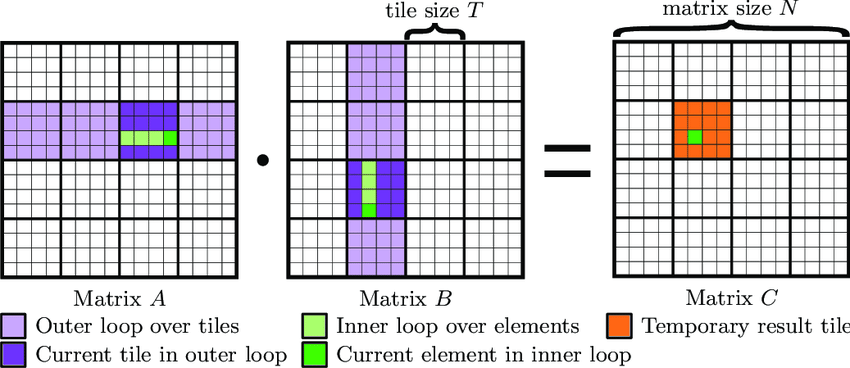

# This Week's Coursework

The coursework for this week comes with two tasks.
Task 1 is to implement overlapping of communication and computation using streams.
Task 2 is to optimize a tiled matrix multiplication kernel using the NVIDIA Nsight profiling tool.

## Task 1
Have a look at the provided `task.cu` file.
The function `matrixMultiplyNoStreams` implements a sequence of 10 matrix multiplications.
Implement a version where the communication and computation overlap using streams as discussed in the last lecture.
Implement this in the function `matrixMultiplyWithStreams`. There are a couple of TODOs to help you get started.

查看提供的 task.cu 文件。
函数 matrixMultiplyNoStreams 实现了连续的 10 次矩阵乘法。

你的任务是实现一个版本，使得通信（数据拷贝）与计算能够像上节课讨论的一样，通过 streams 重叠进行。
请在 matrixMultiplyWithStreams 函数中完成实现，已经提供了多个 TODO 供你参考。

## Task 2
The kernel `matrixMultiplyKernel` in the `task.cu` file implements a naive matrix multiplication.
Implement a new kernel `matrixMultiplyKernelTiled` that implements tiled matrix multiplication which is explained below.
There are a couple of TODOs to help you get started.

Pick meaningful parameters for launching the kernel and the tile size.
Keep in mind the other optimizations that we talked about in class, such as memory coalescing, shared memory, and warp divergence.

For this coursework you may assume that the matrices are square and have a size that is a power of 2.

task.cu 文件中的 matrixMultiplyKernel kernel 实现了一个朴素（naive）的矩阵乘法。

你需要实现一个新的 kernel：matrixMultiplyKernelTiled，它基于下面解释的分块（tiling）矩阵乘法。
文件中也提供了若干 TODO 供你开始实现。

请为 kernel 的 launch 参数以及 tile 大小选择合理的数值。
同时记住课堂上提到的其他优化方法，例如内存访问整合（memory coalescing）、共享内存使用，以及避免 warp divergence。

对于本次作业，你可以假设矩阵是方阵，并且矩阵大小是 2 的幂次。

---

# Tiling a Matrix Multiplication

Matrix Multiplication (MM) is a ubiquitous task at the core of many applications (ML, Solvers, Ray Tracers, etc.) that lends itself especially well to the massively parallel nature of GPUs.
However, without memory access optimizations we are only able to achieve a small fraction of the theoretical FLOPs available to us.
Tiling is a very important optimizations used to optimize MM on GPUs by improving data locality and reducing memory access overhead, enabling efficient use of shared memory and furthermore enabling more advanced optimizations.

矩阵乘法（MM）是许多应用（机器学习、求解器、光线追踪器等）的核心任务，非常适合 GPU 的大规模并行结构。
然而，如果没有进行内存访问优化，我们只能得到理论 FLOPs 的一小部分。

分块（tiling） 是矩阵乘法中非常重要的优化，它通过提升数据局部性、减少内存访问开销，使共享内存得以高效使用，也为进一步的高级优化铺平道路。

## 1. Basics of Matrix Multiplication

For two matrices \(A\) (size \(M \times K\)) and \(B\) (size \(K \times N\)), the resulting matrix \(C\) (size \(M \times N\)) is computed as:

\[
C[i, j] = \sum_{k=0}^{K-1} A[i, k] \cdot B[k, j]
\]

To compute \(C\), we need to access elements from \(A\) and \(B\) multiple times. Without optimization, each access to \(A\) and \(B\) may involve fetching data from slow global memory, which is expensive. As a result, the naive kernel is most likely to be memory bound.

Tiling addresses this by minimizing global memory accesses and maximizing shared memory usage.

为了计算  C。 我们必须多次访问  A 和 B 的元素。 如果没有优化，每一次访问都可能从速度很慢的全局内存读取数据，这是非常昂贵的。结果是朴素的 kernel 往往受限于内存带宽。

Tiling 的作用是减少全局内存访问，最大化共享内存的利用。

## 2. What Is Tiling?

Tiling is a method of dividing the computation into smaller chunks or **tiles** of size \(T\) that fit into the GPU's shared memory.
Each tile focuses on a sub-region of \(A\), \(B\), and \(C\).
Threads collaboratively load these sub-regions into shared memory, perform the computation locally, and then write the results back to global memory.

分块（tiling）是一种将计算划分为多个更小的 T × T 子块（tile） 的方法，使这些子块可以放入 GPU 的共享内存中。

每个 tile 关注矩阵 A， B, C 的一小部分。
线程会协作把这些子块加载到共享内存中，在本地进行计算，然后再把结果写回全局内存。

## 3. A Recipe for Tiled Matrix Multiplication

1) Partitioning:
    The matrices \(A\), \(B\) and \(C\) are divided into tiles of size \(T \times T\).
    For example, if \(T = 16\), each thread block computes a \(16 \times 16\) tile of \(C\).

2) Thread Mapping:
    A thread block is assigned to compute one tile of \(C\). Each thread in the block is responsible for computing one element of the tile of \(C\).

3) Load Data into Shared Memory:
    Threads cooperatively load the necessary tile of \(A\) and \(B\) into shared memory.

4) Compute the Tile:
    Once \(A\) and \(B\) tiles are in shared memory, each thread computes its assigned part of the \(C\) tile. Threads iterate over the \(K\)-dimension in chunks of \(T\), using shared memory for intermediate results.

5) Write Results to Global Memory:
    After computing the partial sum for the tile, each thread writes its result back to the corresponding location in global memory for \(C\).

1) 分块：

将矩阵 A B C 划分为  T×T 的 tiles。
例如，如果  T=16，每个线程块计算  C 中一个  16×16 的 tile。

2) 线程映射：

一个 thread block 负责计算 C 中的一个 tile。
每个线程计算该 tile 中的一个元素。

3) 加载数据到共享内存：

线程协作将对应的 A 和 B 的 tile 加载到 shared memory。

4) 计算 tile： 当  A 与  B 的 tile 位于 shared memory 后，线程在本地执行计算。 线程会以 tile 为单位遍历 K 维度，用共享内存中的数据计算部分结果。

5) 写回全局内存： 计算完 tile 的部分结果后，每个线程将自己的结果写回全局内存对应的  C 位置。

---
